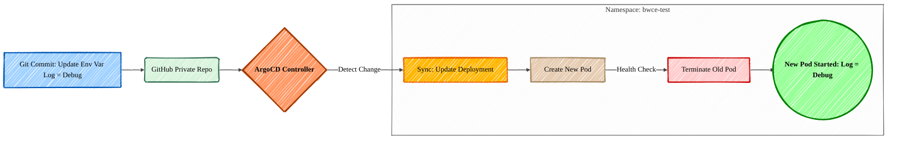
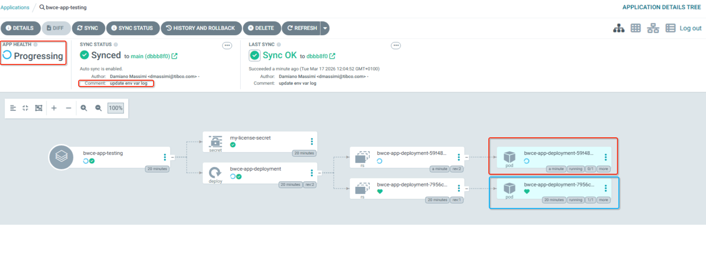

# BWCE GitOps with ArgoCD

This repository is a **sample** designed to demonstrate how to deploy TIBCO BusinessWorks Container Edition (BWCE) applications to Kubernetes using ArgoCD. It serves as a blueprint for implementing a GitOps workflow.

## 🎯 Purpose
The purpose of this repository is to implement a GitOps workflow for BWCE applications. It automates the deployment process, ensures environment consistency, and provides a clear audit trail of all infrastructure changes.

### Core Benefits:
- **Automated Deployments:** Any change pushed to the manifests is automatically synced to the cluster.
- **Drift Detection:** ArgoCD monitors the cluster and automatically corrects manual overrides to match the Git state.
- **Environment Isolation:** Uses dedicated namespaces (e.g., bwce-test) to separate application workloads.
- **Secure Access:** Configured specifically to work with GitHub Fine-grained Personal Access Tokens (PATs).

---

## 📂 Repository Structure
- **/bwce-manifests**: This directory contains all Kubernetes resource definitions, including:
  - `bw-app-deployment.yaml`: The Deployment configuration for the BWCE application.
  - `my-license-secret.yaml`: The Secret to save license file used by BWCE application.
- **/argocd-apps**
  - `bwce-argocd-app.yaml`: The ArgoCD Application manifest used to register this project with the ArgoCD controller.

---

## 🚀 Quick Start

### 1. Prerequisites
- A running Kubernetes cluster (Docker Desktop, K3s, or similar).
- A GitHub Fine-grained Token with 'Metadata' (Read) and 'Contents' (Read) permissions.
- A valid license base64 file in `./bwce-manifest/my-secret-license`
- BW images built locally (in my case is my-bw-app:6.12.0. Base image used: BW 6.12)

### 2. Infrastructure Setup
To bootstrap this environment, follow the sequence below:
1. Install ArgoCD into the `argocd` namespace.
2. Create the repository secret in the `argocd` namespace using your GitHub PAT and the `x-access-token` username.
3. Label the secret with `argocd.argoproj.io/secret-type=repository`.

### 3. Application Deployment
Apply the Application manifest to start the sync:
`kubectl apply -f bwce-argocd-app.yaml -n argocd`

---

## 🛠 Operation & Maintenance

### Deployment Flow
The following diagram illustrates how a change (like a log level update) moves from your computer to the running cluster:



## 🧪 Testing & Validation

Follow these steps to verify that the GitOps pipeline is working correctly (file local-commands.txt contains all commands executed in terminal):

### 1. Deploy the ArgoCD Application

Run the following to register the app:
`kubectl apply -f argocd-apps/bwce-argocd-app.yaml -n argocd`

### 2. Update Environment Variables
Modify `bwce-manifests/bw-app-deployment.yaml` to change the log level:

```yaml
env:
- name: BW_LOGLEVEL
  value: "DEBUG"
```

### 3. Push to Git
```bash
git add .
git commit -m "update env var log"
git push origin main
```

### 4. Observe the Update
ArgoCD UI: The application will transition to OutOfSync and then Synced.
Kubernetes: A new Pod will be created (in RED). Verify the env var with: `kubectl exec -it <pod-name> -n bwce-test -- env | grep BW_LOGLEVEL`



## 📝 Configuration Details
- ArgoCD Namespace: argocd
- Application Namespace: bwce-test
- Sync Policy: Automated (Prune: True, SelfHeal: True)
- Target Revision: HEAD
